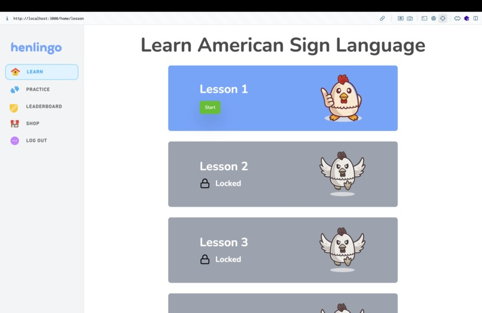
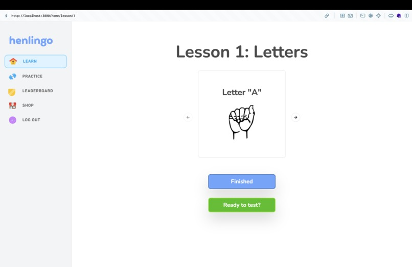
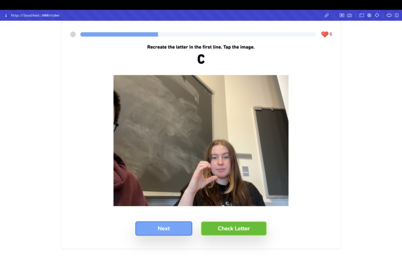

# Henlingo



### HenHacks Spring 2024, University of Delaware Hackathon

**Developed by:** Daniel, Vansh, and Ariana

[Devpost Project Page](https://devpost.com/software/henlingo)

## Demo Video

  <a href="https://youtu.be/PDFEDDahH1c">
    
  </a>

## 🧠 Inspiration

Growing up, one of our team members was inspired by their best friend’s mother, who was hard of hearing and taught ASL. She often spoke about the need for a mainstream, accessible way to learn ASL. Learning sign language can often be challenging and inaccessible. Henlingo addresses this gap with a Duolingo-style app designed to make learning sign language engaging, effective, and inclusive.

## 🚀 Features

- **Interactive Learning**: Game-like lessons for an enjoyable learning experience.
- **AI-Powered Feedback**: Real-time analysis to improve signing skills.
- **Progress Tracking**: Personalized tracking to motivate learners on their journey.

## 💻 Technology Stack
- Frontend: TypeScript, NextJS, TailwindCSS, Shadcn
- AI/ML: TensorFlow
- Design: Figma

## App Preview
### Lesson Page

### Quiz Page


## Getting Started

First, run the development server:

```bash
npm run dev
# or
yarn dev
# or
pnpm dev
# or
bun dev
```

Open [http://localhost:3000](http://localhost:3000) with your browser to see the result.
